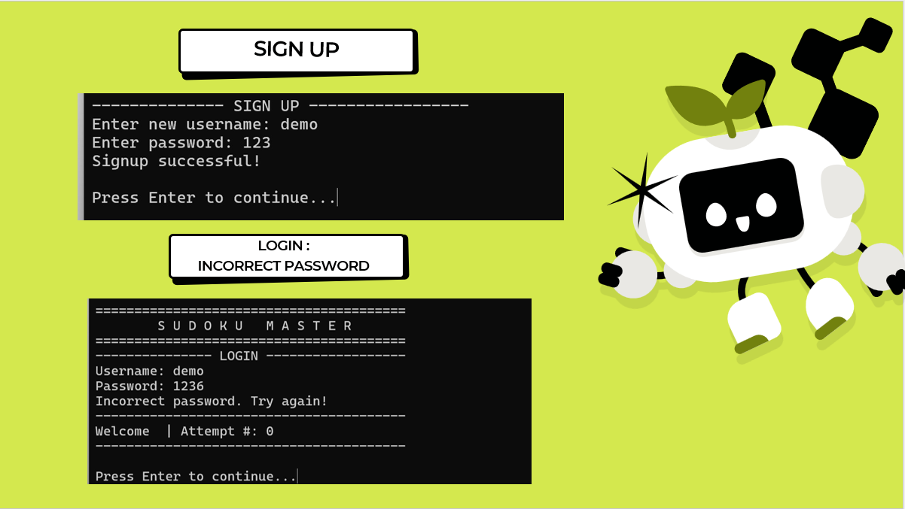
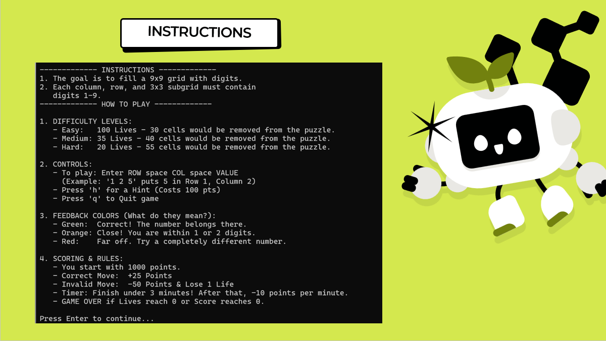
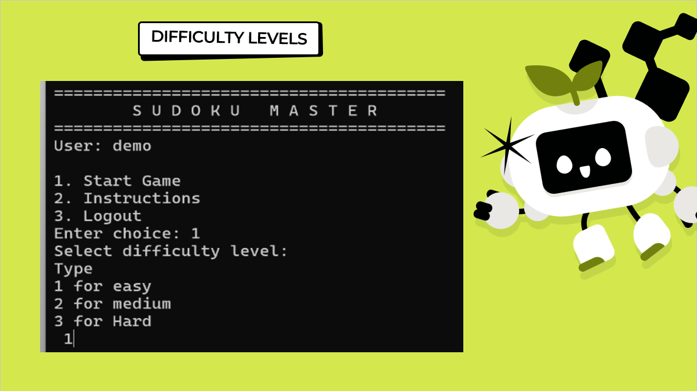
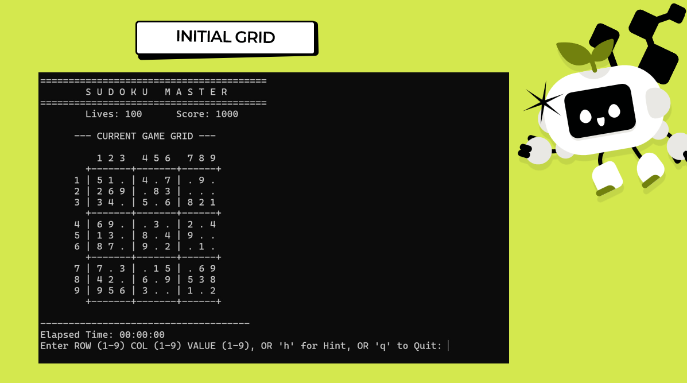

# Sudoku Master
Made by Eiman Fatima, Arham Nabi and Maryam Amir

### Interactive Console-Based Sudoku Engine in C++

Sudoku Master is a **C++ console application** that generates and lets users solve **9×9 Sudoku puzzles** with **automatic validation, hints, scoring, and lives tracking**.  

Unlike standard solvers, this project is a **learning-focused engine**, guiding users with **color-coded feedback**, hinting systems, and a **dynamic scoring system**. Every aspect is built to **teach logical reasoning and enforce Sudoku rules in real time**.

---

## Project Demo

Watch the full demo:

---

## Technical Novelty

Sudoku Master incorporates **advanced programming techniques and algorithms**, making it much more than a solver:

- **Backtracking Algorithm**: `generateFullGrid()` recursively fills the Sudoku grid using `isSafe()` for validation.  
- **Fisher-Yates Shuffle**: Randomizes arrays to create **unique puzzle layouts** efficiently.  
- **Dynamic Puzzle Generation**: Removes cells based on difficulty while ensuring solvability.  
- **Coordinate-Based Input Handling**: Users enter moves as `row column value`, with **immediate validation**.  
- **Color-Coded Feedback Engine**:  
  - Green: Correct placement  
  - Yellow: ±1 or ±2 from correct value  
  - Red: Far from correct value  
- **Hint System**: Reveals a random empty cell while applying **score penalties**.  
- **Scoring System**: Tracks **time, invalid moves, hints used**, and dynamically calculates the final score.  
- **Game State Management**: Tracks **filled cells, locked cells, invalid moves, lives**, and triggers **win/loss conditions**.  
- **User Authentication**: Implements **file-based login/signup**, case-insensitive username handling, and attempt tracking.  
- **Input Validation & Exception Handling**: Prevents invalid rows, columns, and values.  
- **Console Formatting & ANSI Colors**: Provides a **visually structured grid**, with feedback for user-entered cells.  

---

## Key Features

1. **Automatic Sudoku Generation** using backtracking and `isSafe()`.  
2. **Difficulty Levels**: Easy, Medium, Hard (adjusts removed cells and lives).  
3. **Randomized Cell Removal**: Uses Fisher-Yates shuffle for efficiency.  
4. **Real-Time Rule Validation**: Checks rows, columns, and 3×3 subgrids.  
5. **Locked Cells**: Original cells cannot be edited.  
6. **Overwrite Handling**: Users can update their own entries safely.  
7. **Color-Coded Feedback** for user entries relative to the solution.  
8. **Hint System** with score penalty.  
9. **Timer & Dynamic Scoring** based on **time, invalid moves, and hints used**.  
10. **User Authentication & Attempt Tracking** with file handling (`users.txt`).  
11. **Clear Console Display**: Grid formatting, instructions, and feedback.  
12. **Robust Input Handling**: Handles numeric, non-numeric, and invalid commands.  

---

## Programming Concepts and Tools

**Tools:** Visual Studio 2022, C++  

**Libraries & Headers:**  
- `<iostream>` for I/O  
- `<cstdlib>` for random number generation  
- `<algorithm>` for `swap()` (Fisher-Yates shuffle)  
- `<fstream>` for file handling  
- `<cctype>` and `<string>` for input processing  
- `<ctime>` for timers and randomness  
- `<cmath>` for math operations  
- `<limits>` for input stream validation  

**Concepts Implemented:**  
- **2D Arrays** for puzzle, solution, and user grid.  
- **Recursion & Backtracking** for grid generation.  
- **Fisher-Yates Shuffle** for randomizing number arrays and cell removal.  
- **Conditional Statements & Loops** for validation, grid display, and gameplay logic.  
- **Functions** for modular design (`generateFullGrid`, `isSafe`, `removeCells`, `displayFullGrid`, etc.).  
- **File I/O** for authentication, attempt tracking, and persistent user data.  
- **ANSI Color Codes** for visual feedback.  
- **Input Validation** with exception handling (`stoi`, `isdigit`) to ensure robustness.  

---

## System Design Overview

1. **Sudoku Generation:**  
   - `generateFullGrid()` fills the 9×9 grid recursively.  
   - `isSafe()` ensures the number placement obeys row, column, and 3×3 subgrid rules.  

2. **Puzzle Creation:**  
   - `removeCells()` randomly removes a difficulty-dependent number of cells.  
   - Uses Fisher-Yates shuffle to avoid duplicate removals efficiently.  

3. **User Interaction:**  
   - Users input `row col value`.  
   - Locked cells cannot be modified.  
   - Real-time feedback on entry correctness.  

4. **Scoring & Timer:**  
   - Base score: 1000  
   - Penalties for invalid moves (-50), hints (-100), and time (>180s)  
   - Valid moves increment score (+25).  

5. **Game Progression:**  
   - Tracks filled cells, lives, score, and elapsed time.  
   - `checkLoss()` enforces game-over conditions.  
   - `showWin()` displays final score and completion time.  

---

## Controls

| Input           | Action        |
|-----------------|---------------|
| `row col value` | Place number  |
| `h`             | Reveal hint   |
| `q`             | Quit game     |

**Example Input:**
2 5 7
---

## Expected Flow

1. Signup or login with username and password.  
2. Select difficulty level.  
3. View the **formatted Sudoku grid**.  
4. Receive **color-coded feedback** and dynamic score updates.  
5. Use hints strategically.  
6. Complete the puzzle or reach a game-over condition.  
7. Receive final score and statistics.

---

## Testing & Validation

Tested for:  
- Input validation for rows, columns, and values  
- Non-numeric input handling  
- Rule violation detection  
- Locked cell enforcement  
- Overwriting entries  
- Hint system functionality  
- Difficulty and lives enforcement  
- Timer and scoring accuracy  
- Win/Loss conditions  
- User authentication and attempt tracking  

---

## Additional Materials

- [Flowchart](docs/flowchart.pdf) — System logic and grid generation flow  
- [Project PPT](docs/project_presentation.pdf) — Contributions, feature overview, and screenshots  

---
## Screenshots

### 1. User Authentication

### 2. Instructions and Difficulty Selection

### 3. Initial Sudoku Grid

### 4. Gameplay Feedback

### 5. Hint System

### 6. Game Outcomes

---
## Conclusion

Sudoku Master demonstrates **full-stack C++ console programming**, integrating:  
- **Recursion and backtracking**,  
- **Randomized puzzle generation**,  
- **File I/O and authentication**,  
- **Real-time input validation and feedback**,  
- **Dynamic scoring and color-coded hints**.  

It is a **learning-oriented, technically sophisticated Sudoku engine**, showcasing advanced **algorithmic thinking and modular C++ design**.
